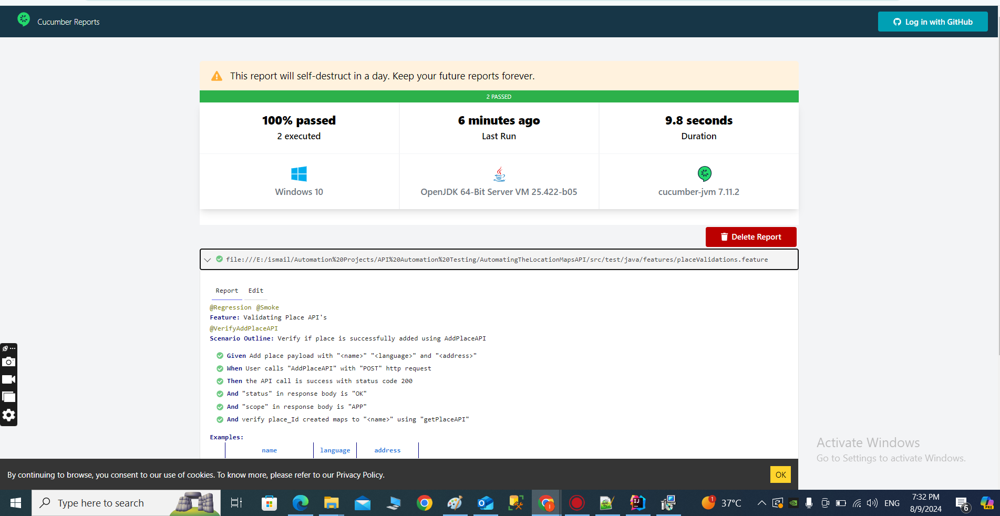

# API Automation Framework with Rest Assured and JAVA 

Description : Automating the Location Maps API using Rest Assured and JAVA with BDD Framework.

## Framework Features

- Maven structured Framework with cucumber and Rest Assured dependencies
- Implemented Page Object Model with Cucumber Framework 
- Implemented Feature files with Test Case you want to automate
- Implemented Smart Step Defifintion files with supported code
- Built Util files to define all the reusable request and response specifications
- Built POJO Classes for serializing** and deserializing JSON PayLoad
- Implement logging into Framework to log request and response details.
- Develop End to End Framework Functionality with all validations and Assertions.
- Define global properties and drive all global variables from properties files
- Define Enum class with constants to centralize all the resource details.
- Add more Tests and implement Tagging mechanism to run selected test from Test Runner file
- Implemented pre and post condition for Test with cucumber Hooks
- Generate Online Cucumber Reports for Test Execution


## Run Instructions
- JDK 1.8
- Maven 
- Plugins for JUnit, Cucumber, 
- Clone repository or download zip and set it up in your local workspace.
- You can run the test locally simply by pasting the feature tag in TestRunner.java file and Click on Report URL To Check the Result
or Check the Report in target\cucumber-report Directory 
- or You can Go to your project directory from terminal and the  following commands
```bash
mvn test
mvn test -Dcucumber.options="--tags @Smoke"
mvn test -Dcucumber.options="--tags @VerifyAddPlaceAPI"
mvn test -Dcucumber.options="--tags @VerifyDeletePlaceAPI"


```
## Reports



